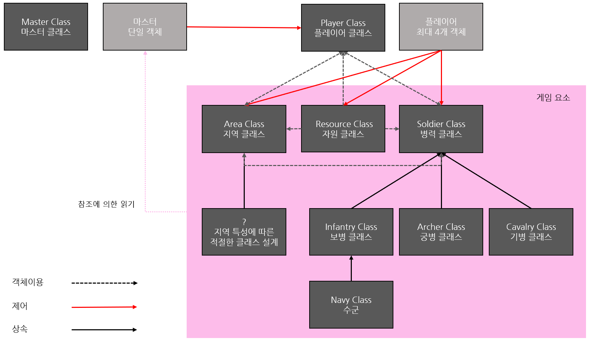

# Hanpotamia
Civilization at Han River<br>
한강 문명 : 종의 기원 <br>

<br>

## Team

[표]

<br>

- Sejong University Problem And Solving C++ (prof. 안용학)
- 최종 팀 프로젝트

<br>

[프로젝트 제안서 / 중간 보고서 link]() <br>

<br>

## Class

### 1차 견본



<br>

### 2차 견본

- [참고자료 : UML Class diagram 기본](https://infinitejava.tistory.com/61)
- [참고자료 : Sequence diagram]
- 추가적으로 더 배우는 내용
- static 클래스

<br>

## VS

- Visual Studio 2019
- Hanpotamia Game 의 Server

<br>

## LAB

- python 기반의 Hanpotamia Game 의 GUI Client

### Dependencies

- python 3.6
- pygame

<br>

## 이름 규칙

### 참조

- NHN/C++ 코딩 규칙
- 안용학 교수님이 수업에서 언급했던 규칙
- Google C++ Style Guide

<br>

### 파일명

- 지금 하고 있는 프로젝트의 컨벤션, 안용학교수님의 컨벤션에 따른다.
- 클래스를 설계하는 경우, 파일 앞에 대문자 C 를 붙인이고, 대쉬 (-) 를 붙이고, 대표 class 이름으로 사용하며, C 를 제외하고는 소문자와 언더바를 사용한다. ex : C-rect_base
- 테스트용 (실행 파일) 의 경우, Test- 를 가장 처음에 포함한다. ex : Test-rect_base
- 파일 이름에 대쉬(-) 를 두 개 이상 사용하지 않는다.

<br>

### 함수명

- 일반적인 함수는 소문자로 시작하며, 각 새로운 단어마다 대문자를 사용한다. 언더라인은 사용하지 않는다. ex : myExcitingFunction()
- 접근자와 수정자(get, set)는 변수 이름과 일치시킨다. ex : set_myExcitingMemberVariable()
- True/False 값을 return 하는 경우, 함수 이름은 is 혹은 has 로 시작한다. ex : isHungry()
- private 함수 이름은 언더바(_) 로 시작한다. ex : \_dontTouchMe()

<br>

### 타입명

- 타입명은 대문자로 시작하며, 각 새로운 단어마다 대문자를 갖으며 언더라인을 사용하지 않는다. ex : MyRectangle

<br>

### 변수 및 상수명

- 변수명은 소문자로 시작하며, 소문자와 언더바만 사용한다.
- static 멤버 변수의 경우 's\_' 으로 시작한다. ex : \s_my_exciting_static_variable
- const 멤버 상수는 'k\_' 로 시작하며 대소문자를 섞어서 사용한다. ex : \k_days_in_a_week
- 그 외 private 멤버 변수 및 private 함수는 '\_' 로 시작한다. ex : \_my_private_variable 
- 이름은 가능한 설명적으로 짓는다. 공간 절약이 중요한 게 아니라, 코드를 즉시 보고 이해할 수 있어야 한다. ex : num_completed_connections
- 모호한 약어나 의미를 알 수 없는 임의의 문자를 사용하지 않는다. ex : nerr (?)
- 구조체의 데이터 멤버는 일반적인 변수처럼 이름을 짓는다. 클래스처럼 언더라인으로 끝나지 않는다.
- 전역 변수는 특별한 요구사항이 없으며, 거의 사용을 하지 않는다. 만약 사용한다면, 'g\_'로 시작하거나 로컬 변수와 구별되는 표시를 한다.

<br>

### 기타

- 들여쓰기는 Tab 을 사용한다.
- 간단한 생성자 초기화는 콜론 초기화로 한다.
- 이항 연산자 (=, >, <, 등..) 앞과 뒤에 공백을 제공한다. ex : a = b + c
- 단항 연산자 앞과 뒤에 공백을 제공하나, (A++), [--BB], {--KK}와 같이 사용할 때는 공백이 없어도 좋다.
- 일부 연산자(“ , “, “ ; “)는 연산자 뒤에 공백을 제공해야 한다. ex : for( i = 0; i < 3; i++)
- brace( { )는 분리된 라인에 작성한다.

<br>

```C++
class People
{
// 내용
}
void main()
{
// 내용
}
struct DataStructure
{
// 내용
}
```

### 예시

```C++
class People
{
  private:
  int _age;
  
  public:
  int get_age();
  void set_age();
  void giveAge();
}
```
